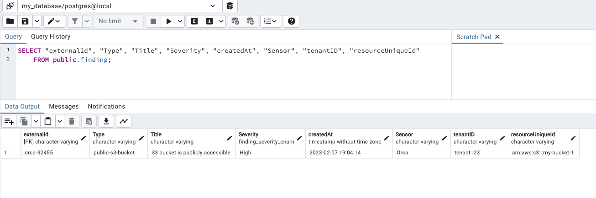
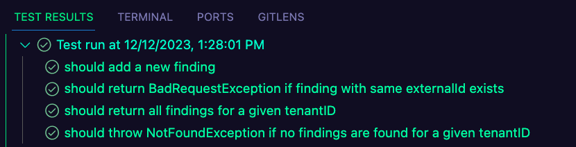

# Opus Home

This project comprises a NestJS-based backend application utilizing TypeORM for database interactions.

Provides RESTful APIs for managing and retrieving findings associated with different tenants.
Findings include attributes like external IDs, types, titles, severity levels, creation timestamps, sensor details, and linked resources.

## Prerequisites

- Node.js (v14 or higher)
- npm or Yarn package manager
- Docker (for optional containerization)

## Setup

1. **Clone the repository:**

    ```bash
    git clone git@github.com:mzsrtgzr2/opus-home.git
    cd opus-home
    ```

2. **Install dependencies:**

    ```bash
    yarn
    ```

3. **Create `.env` file:**

    ```bash
    cp .env.example .env
    ```

4. **Running the Application:**

      ```bash
      yarn run start:dev:db
      yarn run start:dev
      ```

  - `start:dev:db` starts a local postgres container for dev purposes  
  - `start:dev` starts the application in dev mode


5. running http calls

Add a New Finding:

```bash
curl -X POST \
  http://localhost:3000/tenant123/add \
  -H 'Content-Type: application/json' \
  -d '{
    "externalId": "orca-32455",
    "Type": "public-s3-bucket",
    "Title": "S3 bucket is publicly accessible",
    "Severity": "High",
    "createdAt": "2023-02-07T17:04:14+0000",
    "Sensor": "Orca",
    "resource": {
      "uniqueId": "arn:aws:s3:::my-bucket-1",
      "Name": "my-bucket-1",
      "cloudAccount": "475894653712"
    },
    "tenantID": "tenant123"
  }'
  ```
You will receive 200 or if it already exists 400

```
{"message":"Finding with the same externalId already exists","error":"Bad Request","statusCode":400}
```


Get All Findings by Tenant ID:
  
```bash
curl -X GET \
http://localhost:3000/tenant123 \
-H 'Content-Type: application/json'

```
You should see:
```
{"success":true,"data":[{"externalId":"orca-32455","Type":"public-s3-bucket","Title":"S3 bucket is publicly accessible","Severity":"High","createdAt":"2023-02-07T17:04:14.000Z","Sensor":"Orca","tenantID":"tenant123"}]}%
```

You should see in your pgAdmin the following:




## Different Environments

To configure different environments, utilize the `.env` file with necessary environment variables. 
For example, for local development:

Create a `.env` file in the root directory with the following content:

```dotenv
# Local Development
POSTGRES_HOST=127.0.0.1
POSTGRES_PORT=5432
POSTGRES_USER=postgres
POSTGRES_PASSWORD=mysecretpassword
POSTGRES_DATABASE=my_database
PORT=3000
MODE=DEV
```

### Overriding .env Settings
By adjusting the .env file or overriding it with environment variables, you can modify the database connection parameters and other configurations for different environments. For instance:

Change POSTGRES_HOST to point to a different database host.
Modify POSTGRES_PORT for a different database port.
Adjust MODE to define the environment mode (e.g., DEV, PROD).
To use these configurations, ensure the .env file is appropriately set for the intended environment or override specific settings using environment variables when running the application.


## Tests
Run unit tests with the following command:

```bash

yarn test
```




#### `addFinding`
- **Description:** Tests the functionality to add a new finding.
- **Test Case 1:** Successfully adds a new finding with unique `externalId`.
- **Test Case 2:** Throws `BadRequestException` when trying to add a finding with an existing `externalId`.

#### `getAllFindingsByTenantID`
- **Description:** Verifies the retrieval of all findings for a specific tenant ID.
- **Test Case 1:** Successfully fetches all findings for a given `tenantID`.
- **Test Case 2:** Throws `NotFoundException` when no findings are found for a specific `tenantID`.
