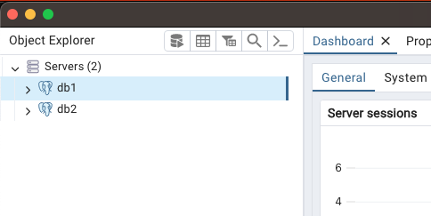
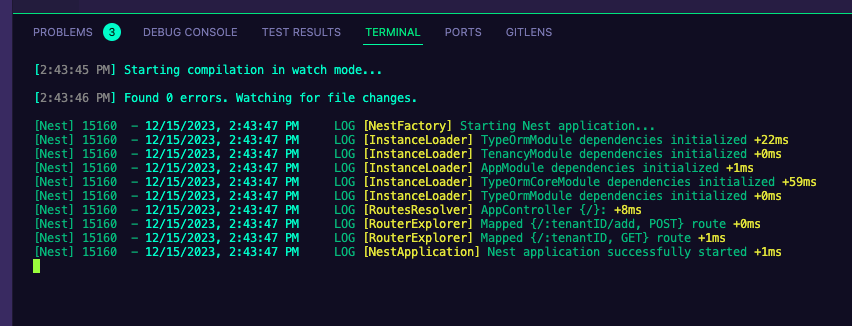
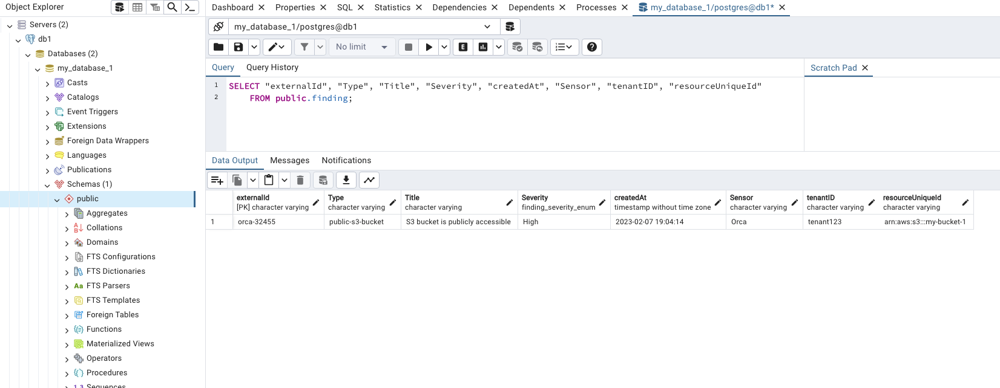
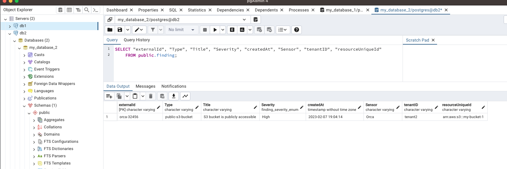

# Opus Home

## Part1
This project comprises a NestJS-based backend application utilizing TypeORM for database interactions.

Provides RESTful APIs for managing and retrieving findings associated with different tenants.
Findings include attributes like external IDs, types, titles, severity levels, creation timestamps, sensor details, and linked resources.


**The get findings api is paginated because of the large amount of data that can be returned.**

## Part2 - Multi-Tenancy with Multi-Databases

### Injecting a Connection into a Service
After considering several approaches (like middleware, decorators, etc.), I decided to go with the approach of injecting 
a connection into the service while scoping down the service to REQUEST (meaning that a new instance of the service is created for each request 
and the repository will be created based on the injected connection we provided).

So part one is to add `tenancy.module` to the application:
```typescript
import { Global, Module, Scope } from '@nestjs/common';
import { REQUEST } from '@nestjs/core';
import { Connection, ConnectionOptions, createConnection, getConnection } from 'typeorm';
import { configService } from './config.service';

const connectionFactory = {
  provide: 'CONNECTION',
  scope: Scope.REQUEST,
  useFactory: async (req) => {
    const tenant = req.params.tenantID || 'default'; // TODO: Handle missing tenant id better
    
    const connectionName = configService.getDatabaseForTenant(tenant);
    // Check if the connection exists, if not, create a new one
    try {
        return getConnection(connectionName);
      } catch (error) {
        const tenantConfig = configService.getTenantTypeOrmConfig(connectionName) as ConnectionOptions;
        const connection: Connection = await createConnection(tenantConfig);
        return connection;
      }
    
  },
  inject: [REQUEST],
};

@Global()
@Module({
  providers: [connectionFactory],
  exports: ['CONNECTION'],
})
export class TenancyModule {}

```

and the second part is to inject it to the service:

```typescript
@Injectable({scope: Scope.REQUEST})
export class AppService {
  private readonly findingRepository: Repository<Finding>;
  private readonly resourceRepository: Repository<Resource>;

  constructor(@Inject('CONNECTION') connection) {
    this.findingRepository = connection.getRepository(Finding);
    this.resourceRepository = connection.getRepository(Resource);
  }
  
```


### Loading the Available configurations
Another piece in the puzzle is the `config.yaml` to load the database parmaeters and the 
assignments to the tenants. you can find it  under `src/resources/config.yaml`

```yaml
default:
  host: 127.0.0.1
  port: 5431
  database: public
  username: postgres
  password: mysecretpassword_1

databases:
  - name: db1
    host: 127.0.0.1
    port: 5431
    database: public
    username: postgres
    password: mysecretpassword_1
    tenants: [
      tenant123
    ]
  - name: db2
    host: 127.0.0.1
    port: 5432
    database: public
    username: postgres
    password: mysecretpassword_2
    tenants: [
      tenant2,
    ]
      

```

This yaml is loaded in [`config.service`](./src/config/config.service.ts) and we have functions inside to support the basic mappings and lookup operations.


### Considerations

Pros:
Easy to use and understand

Cons:
This approach is prone to raising the count of concurrent connections. Even with connection pooling, this can result in potential performance challenges. 
Thus, this strategy, which associates one connection with each tenant, is most efficient when managing a relatively small number of tenants.

## Assumptions:
- every request that uses the tenantID data needs to have the parameter tenantID in the request parameters.
     because of this piece of code:

    ```
    const connectionFactory = {
      provide: 'CONNECTION',
      scope: Scope.REQUEST,
      useFactory: async (req) => {
        const tenant = req.params.tenantID || 'default'; 
      ```

    otherwise we use the 'default' database connection.

## TODOs

I left in the code @Todo in comments...


## Prerequisites

- Node.js (v14 or higher)
- npm or Yarn package manager
- Docker (for optional containerization)

## Setup

1. **Clone the repository:**

    ```bash
    git clone git@github.com:mzsrtgzr2/opus-home.git
    cd opus-home
    ```

2. **Install dependencies:**

    ```bash
    yarn
    ```

3. **Create `.env` file:**

    ```bash
    cp .env.example .env
    ```

4. **Running the Application:**

      ```bash
      yarn run start:dev:db1  # starts a local postgres container for dev purposes  
      yarn run start:dev:db2  # starts a local postgres container for dev purposes  
      yarn run start:dev  # starts the application in dev mode  
      ```

    you should see two running postgres servers:  
    


    and the app running:  
    


5. **Running the api calls:**

    Add a New Finding for tenant123 (shoud show in db1):

    ```bash
    curl -X POST \
      http://localhost:3000/tenant123/add \
      -H 'Content-Type: application/json' \
      -d '{
        "externalId": "orca-32455",
        "Type": "public-s3-bucket",
        "Title": "S3 bucket is publicly accessible",
        "Severity": "High",
        "createdAt": "2023-02-07T17:04:14+0000",
        "Sensor": "Orca",
        "resource": {
          "uniqueId": "arn:aws:s3:::my-bucket-1",
          "Name": "my-bucket-1",
          "cloudAccount": "475894653712"
        },
        "tenantID": "tenant123"
      }'
      ```
    You will receive 200 
    ```
    {"success":true,"data":{"externalId":"orca-32455","Type":"public-s3-bucket","Title":"S3 bucket is publicly accessible","Severity":"High","createdAt":"2023-02-07T17:04:14.000Z","Sensor":"Orca","resource":{"uniqueId":"arn:aws:s3:::my-bucket-1","Name":"my-bucket-1","cloudAccount":"475894653712"},"tenantID":"tenant123"}}%
    ```
    
    or if it already exists 400

    ```
    {"message":"Finding with the same externalId already exists","error":"Bad Request","statusCode":400}
    ```

    we should see it in db1, and we do:
      


    Get All Findings by Tenant ID:
      
    ```bash
    curl -X GET \
    http://localhost:3000/tenant123 \
    -H 'Content-Type: application/json'

    ```
    You should see:
    ```
    {"success":true,"data":[{"externalId":"orca-32455","Type":"public-s3-bucket","Title":"S3 bucket is publicly accessible","Severity":"High","createdAt":"2023-02-07T17:04:14.000Z","Sensor":"Orca","tenantID":"tenant123"}],"page":1,"totalCount":1,"totalPages":1}%
    ```

    the response is paginated, so if we add more findings we will see the pagination in action.


    Now, lets add another tenant - tenant2, that is mapped in our config.yaml to db2:
  

    ```bash 
      curl -X POST \
        http://localhost:3000/tenant2/add \
        -H 'Content-Type: application/json' \
        -d '{
          "externalId": "orca-32456",
          "Type": "public-s3-bucket",
          "Title": "S3 bucket is publicly accessible",
          "Severity": "High",
          "createdAt": "2023-02-07T17:04:14+0000",
          "Sensor": "Orca",
          "resource": {
            "uniqueId": "arn:aws:s3:::my-bucket-1",
            "Name": "my-bucket-1",
            "cloudAccount": "475894653712"
          },
          "tenantID": "tenant2"
        }'
    ```

    indeed we get http 200:
    ```bash
      {"success":true,"data":{"externalId":"orca-32456","Type":"public-s3-bucket","Title":"S3 bucket is publicly accessible","Severity":"High","createdAt":"2023-02-07T17:04:14.000Z","Sensor":"Orca","resource":{"uniqueId":"arn:aws:s3:::my-bucket-1","Name":"my-bucket-1","cloudAccount":"475894653712"},"tenantID":"tenant2"}}%
    ```

    and we see it only in db2:

    


## Tests
Run unit tests with the following command:

```bash

yarn test
```

***Note:*** *The tests are not passing, this is TBD*

